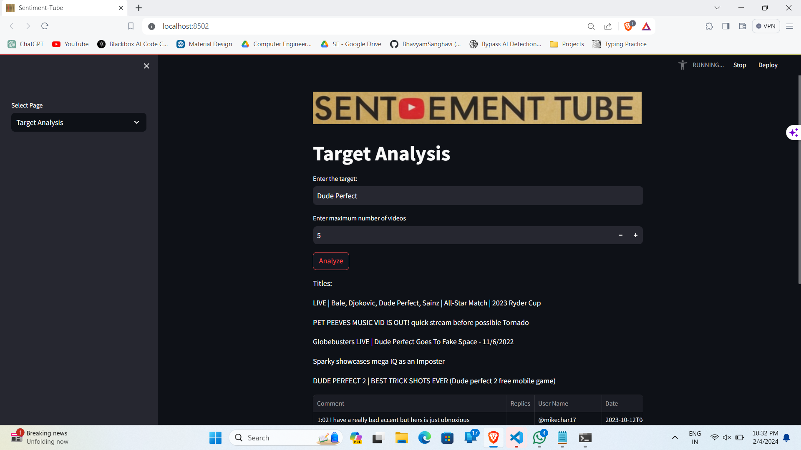

<h1 align="center">Sentiment Tube</h1> 
 A Streamlit application for analyzing and visualizing sentiment in YouTube video comments. 
 <h2>Installation</h2> <ol> <li>Clone the repository: <code>git clone https://github.com/decodingafterlife/Sentiment-Tube.git</code></li> <li>Install dependencies: <code>cd Sentiment-Tube && pip install -r requirements.txt</code></li> </ol> <h2>Usage</h2> <ol> <li>Add your YouTube API key in the <code>video_based_analysis.py</code> and <code>target_based_analysis.py</code> files in the "api\_key" variable.</li> <li>Run the application: <code>streamlit run app.py</code></li> <li>Open your browser and navigate to <a href="http://localhost:8501">http://localhost:8501</a>.</li> <li>Explore sentiment analysis, visualizations, and download results using the provided options.</li> </ol> <h2>Visualizations</h2> <ul> <li>Pie Charts: Visual representation of sentiment distribution.</li> <li>Word Clouds: Graphical representation of frequently occurring words in positive, negative, and neutral comments.</li> <li>Various Graphs and Diagrams: Flexible data visualization options to meet specific needs.</li> </ul> <h2>Download Results</h2> 
 Click the "Download Results" button to save sentiment analysis results in CSV format. 
 <h2>Dependencies</h2> <ul> <li><a href="https://streamlit.io/">Streamlit</a></li> <li><a href="https://developers.google.com/youtube/registering_an_application">YouTube API</a></li> <li><a href="https://material-ui.com/">Material Design</a></li> <li><a href="https://pypi.org/project/wordcloud/">Wordcloud</a></li> <li><a href="https://pypi.org/project/plotly/">Plotly</a></li> <li><a href="https://pypi.org/project/pandas/">Pandas</a></li> <li><a href="https://pypi.org/project/numpy/">Numpy</a></li> <li><a href="https://pypi.org/project/scikit-learn/">Scikit-learn</a></li> </ul> <h2>Contributors</h2> <ul> <li><a href="https://github.com/decodingafterlife">decodingafterlife</a></li> <li><a href="https://github.com/BhavyamSanghavi">BhavyamSanghavi</a></li> </ul> <h2>License</h2> 
 This project is licensed under the terms of the <a href="https://github.com/decodingafterlife/Sentiment-Tube/blob/main/LICENSE">MIT License</a>. 

<h1> My Repo</h1>

